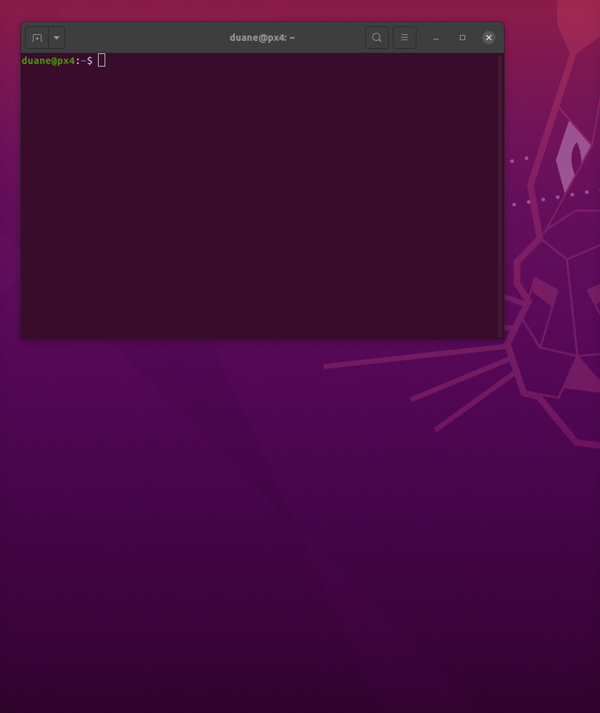
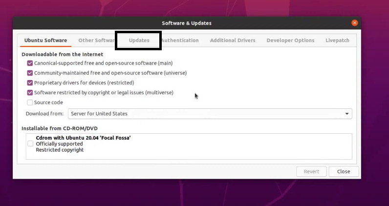
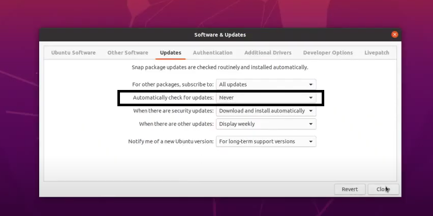

# ubuntu-notes

## ssh to another server, export Xwindows via SSH, and change the terminal colorscheme

setup a new proflie



then add alias to .bash_aliases or .bashrc

```
alias ssh_to_external_host='gnome-terminal --profile external_host -- ssh -X myaccount@192.168.1.133'
```

## setup a ubuntu multi boot partition

1.  Ensure that your disk is setup with g-parted so that free space is available at the end of the disk
2.  Download the ISO image you want to muli boot
3.  Burn the image onto a memory key using rufus
4.  Boot from the key and select "install"

if you have video issues on boot, this is likely caused by the nouveau driver not handling multiple GPUs

    1. Select the install ubuntu option
    2. Press 'E' key to edit
    3. [add nomodeset after "quiet splash " and before "$vf_handoff" ](https://www.dell.com/support/kbdoc/en-us/000123893/manual-nomodeset-kernel-boot-line-option-for-linux-booting)

5.  Follow the install prompts until it asks for a partition to install on
6.  Click on "free space"
7.  Create a ext4 partiion of the required size, set root folder to "/"
8.  Find and select the new device eg: /dev/nvme0n1p6
9.  Install the operating system
10.  Blacklist the nouveau driver

```bash
sudo bash -c "echo blacklist nouveau > /etc/modprobe.d/blacklist-nvidia-nouveau.conf"
sudo bash -c "echo options nouveau modeset=0 >> /etc/modprobe.d/blacklist-nvidia-nouveau.conf"
sudo update-initramfs -u
```

11. Reboot
12. Install build essential

```bash
sudo apt install build-essential
```

13.  Install the nvidia driver using the .run install method  (I've found this works best)

Now you should be able to reboot without a nomodeset, verify this works...

14. Reboot and load into your primary OS

```
sudo update-grub
sudo reboot
```

Now you should have your old boot menu back.

To prevent unattended updates wrecking your video drivers.




